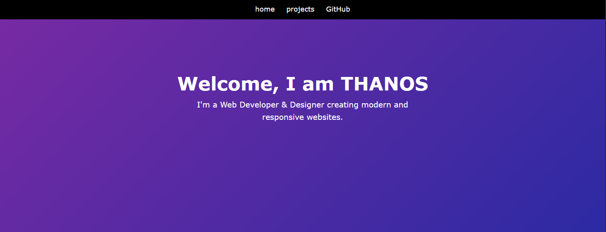
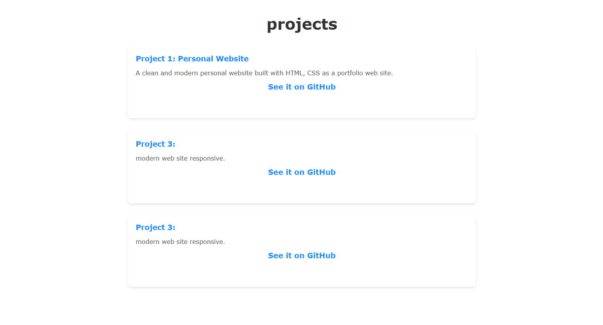

🌐 Simple Web Portfolio Template

A clean and lightweight portfolio template built with HTML and CSS, designed for developers who want a simple and professional way to present their projects online.

The project focuses on minimal design, fast loading, and easy customization, making it ideal for beginners who want to create their first personal portfolio.

✨ Features
📱 Responsive design (mobile, tablet, desktop)
🎨 Minimal and clean UI
⚡ Lightweight and fast
🛠️ Easy to customize
📂 Simple project structure for beginners
💡 Perfect starting point for a personal developer portfolio
📂 Project Structure

The template is organized in a simple and beginner-friendly way so it can be easily modified.

Example structure:

simple-portfolio-site-opensource/
│
├── index.html
├── style.css
└── README.md

🚀 How to Use
Download or Fork this repository
Open the project in your preferred code editor (VS Code recommended)
Edit the content:
Home section
Projects
Footer
Social links
Add your own projects, images, and information
Deploy your portfolio online.
🌍 Live Demo🔗:  https://simple-portfolio-opensource.netlify.app

License

This project is licensed under the MIT License, meaning you are free to use and modify it.
